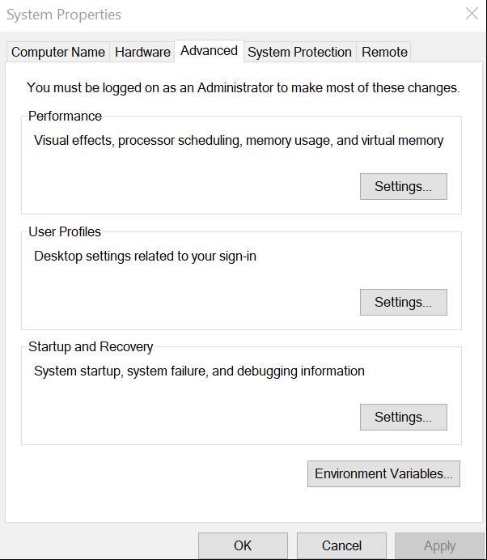
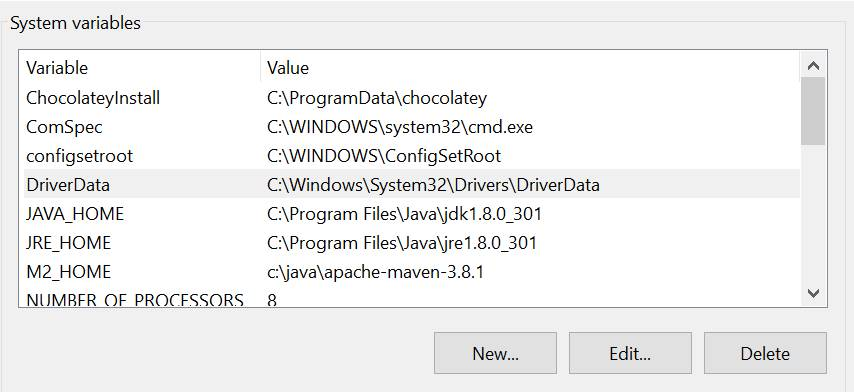
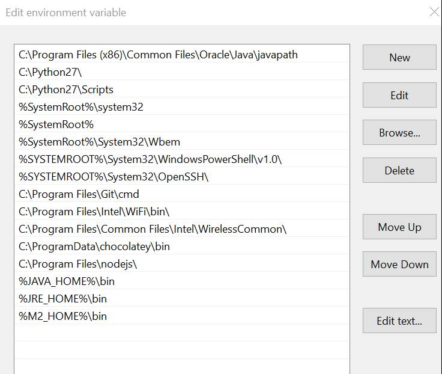
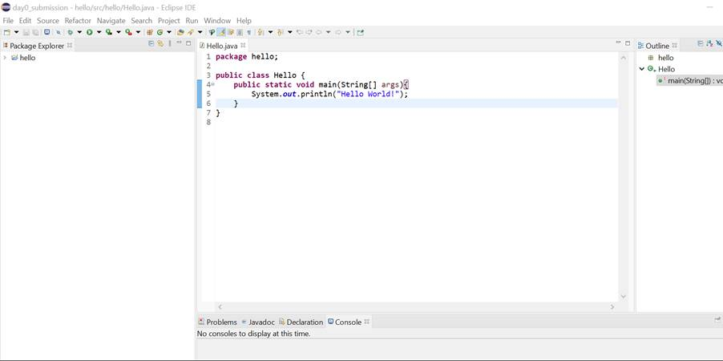
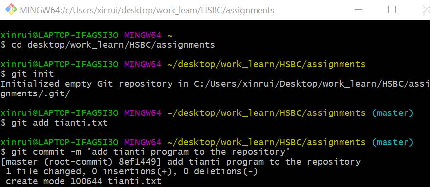
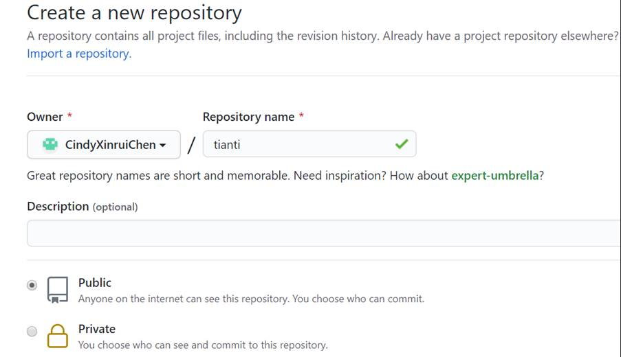
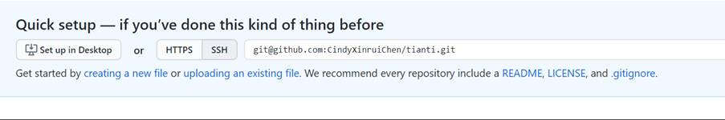
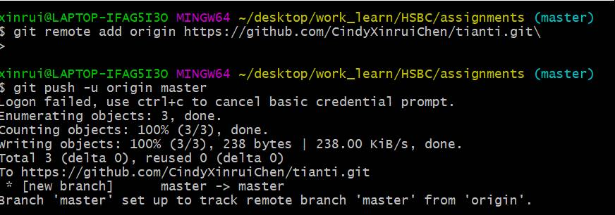
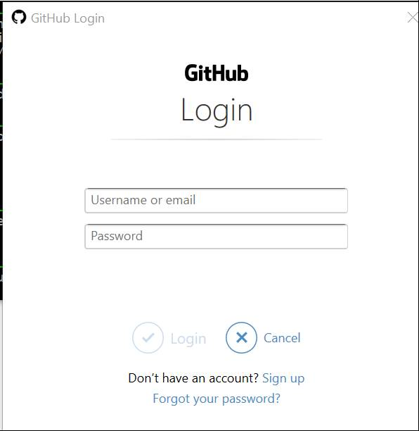

Download Eclipse, JDK and Java 8 and then set up the environment variables

 

Then open the terminal and navigate to the directory and initialize git in the directory. Add and commit the files to the repository

 

Open GitHub and make a new repository

Copy the address for the repository

Go back to the terminal and push to the repository

 

Have to input the account and password

 

Check on the github repository and files should be there
